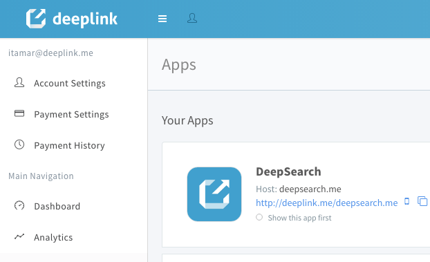
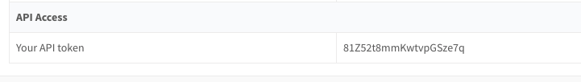

<p align="center">

</p>
<h1 align="center">AppWords</h1>

<br>

## Requirements

- iOS 9.0+
- Xcode 8.0+
- Swift 3.0+

## Integration Steps

### CocoaPods

To integrate AppWordsSDK into your Xcode project using CocoaPods, specify it in your `Podfile`:

```ruby
platform :ios, '9.0'
use_frameworks!

target '<Your Target Name>' do
    pod 'AppWords'
end
```

Then, run the following command:

```bash
$ pod install
```

## What is the AppWords Assistant?

The AppWords Assistant is an AI assistant for your app users. You can use the SDK to learn your users habits and actions, and train your AI in the Deeplink portal to provide helpful results linking to other pages inside your app. You provide the SDK with screenshots of intent pages, name them and include location, keywords, etc, and the assistant will learn how to properly respond to user actions according to your needs.

While you are in the training phase of your assistant, there is an optional cards UI to show your users.  The cards will feature popular deep links from your Deeplink account, so when your users finish an action, they can be sent to other popular and interesting pages inside of your app.


## Using the AppWords SDK in your app

To access the SDK from your code, you will need to import the SDK header file:

```swift
import AppWordsSDK
```

## Initializing

Before you start using the AppWordsSDK you should call initialize method in your App Delegate's application:didFinishLaunchingWithOptions: method.

```swift
AppWordsSDK.shared.initialize(apiToken: "API_TOKEN", appId: "APP_ID") { error in
            
    if error == nil {
        print("AppWordsSDK - initialized")
    } else {
        print("AppWordsSDK - init failed: \(error?.localizedDescription)")
    }
}
```

## To find your API Token and App ID:

1) Log into your Deeplink account at [https://portal.deeplink.me/publishers/sign_in](https://portal.deeplink.me/publishers/sign_in) .

2) Click on the user icon.

3) Click "Account Settings".

<p align="center">

</p>

4) At the bottom, you will find your API token.

<p align="center">

</p>

5) As for App ID, go to `https://portal.deeplink.me/apps`, and click the edit button for the app of your choice.

6) In the URL bar, your will find the App ID in the URL string, eg. `https://portal.deeplink.me/apps/[APP_ID]/edit`

**Notes:**

* The completion handler will be called on the main thread.

* The `API_KEY` is the unique developer ID, assigned to you on registering for a Deeplink account. The `APP_ID` is the unique app ID, assigned to the app on creating a new one.

* `API_KEY` and `APP_ID` are check by this method and allow you to send an Intent to the server.

* The SDK status can always be checked by way of the `isInitialized` property.


## Creating an Intent

`Intents` are actions that your users have just completed inside your app.  For example, if you have a travel app and a user has just purchased a flight ticket, then the intent can be named `Booked Flight` or `Bought Plane Ticket`.  It is good practise to keep the same intent name of the same action inside your app, to make training your AI assistant easier and consistent.  

To create and send an Intent to the server you should call the createIntent(type, view, viewName, location, keywords, completion) method.

```swift
AppWordsSDK.shared.createIntent(type: “flight”, view: self.view, viewName: “Flight Purchase Confirmation“, location: "New York City", keywords: [“Jet Blue“], completion: { (error, intent) -> Void in
            
    if let createdIntent = intent {
        print("The Intent was created - \(createdIntent)")
    }
            
})
```


Notes:

* The SDK need be initialized before calling this method.

* The `type` parameter is the name of the Intent. ie. “flight”

* The `view` parameter refers to the view which will be saved as an image, and sent to the server. It can be set into the `nil` value, which will cause the software to make the screenshot of the whole screen. You can pass any object that inherits from UIView class. The method allows you to draw a view hierarchy into the image.

* The `viewName` parameter is the name of the view’ screenshot.

* The `location` parameter should be used if the intent has location data; city, country, or zip code.

* The `keywords` parameter is there to add any metadata to the intent.  Anything that you feel would be useful for the assistant.

* The `completion` parameter is the block to execute after the Intent is created. This block has no return value and takes two parameters. The first parameter, indicates errors if any occur, the second one is the Intent that was created.

## Training Your Assistant

Training your assistant can be done from inside the Deeplink portal.  Portal page will be going live shortly, keep an eye out for it at [https://portal.deeplink.me/appwords](https://portal.deeplink.me/appwords)

<br>

**Please be in touch if you have any additional questions!**

**[itamar@deeplink.me](mailto:itamar@deeplink.me)**