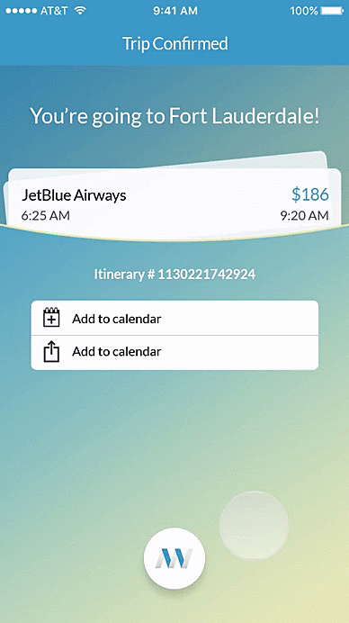
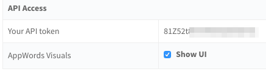
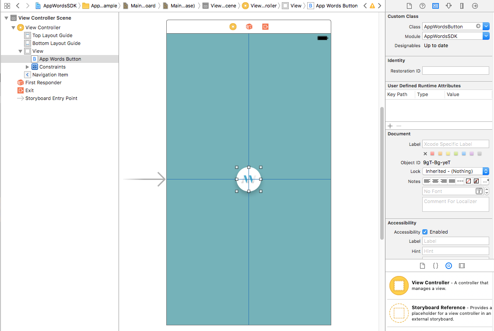

<p align="center">

</p>
<h1 align="center">AppWords</h1>

<br>

## Requirements

- iOS 9.0+
- Xcode 8.0+
- Swift 3.0+

## Integration Steps

### CocoaPods

To integrate AppWordsSDK into your Xcode project using CocoaPods, specify it in your `Podfile`:

```ruby
platform :ios, '9.0'
use_frameworks!

target '<Your Target Name>' do
    pod 'AppWords'
end
```

Then, run the following command:

```bash
$ pod install
```

## What is the AppWords Assistant?

The AppWords Assistant is an AI assistant for your app users. You can use the SDK to learn your users habits and actions, and train your AI in the Deeplink portal to provide helpful results linking to other pages inside your app. You provide the SDK with screenshots of intent pages, name them and include location, keywords, etc, and the assistant will learn how to properly respond to user actions according to your needs.

While you are in the training phase of your assistant, there is an optional cards UI to show your users.  The cards will feature popular deep links from your Deeplink account, so when your users finish an action, they can be sent to other popular and interesting pages inside of your app.

<br>

* [Using the AppWords SDK in your app](#using-the-AppWords-SDK-in-your-app)

* [Creating an Intent](#creating-an-intent)

* [Displaying the Cards UI](#displaying-the-cards-ui)

* [Facebook Messenger integrate](#fb-messenger)


## <a name="using-the-AppWords-SDK-in-your-app"></a>Using the AppWords SDK in your app

To access the SDK from your code, you will need to import the SDK header file:

```swift
import AppWordsSDK
```

## Initializing

Before you start using the AppWordsSDK you should call initialize method in your App Delegate's application:didFinishLaunchingWithOptions: method.

```swift
AppWordsSDK.shared.initialize(apiToken: "API_TOKEN", appId: "APP_ID") { error in

    if error == nil {
        print("AppWordsSDK - initialized")
    } else {
        print("AppWordsSDK - init failed: \(error?.localizedDescription)")
    }
}
```

## To find your API Token and App ID:

1) Log into your Deeplink account at [https://portal.deeplink.me/publishers/sign_in](https://portal.deeplink.me/publishers/sign_in) .

2) Click on the user icon.

3) Click "Account Settings".

<p align="center">

</p>

4) At the bottom, you will find your API token.

<p align="center">

</p>

5) As for App ID, go to `https://portal.deeplink.me/apps`, and click the edit button for the app of your choice.

6) In the URL bar, your will find the App ID in the URL string, eg. `https://portal.deeplink.me/apps/[APP_ID]/edit`

**Notes:**

* The completion handler will be called on the main thread.

* The `API_KEY` is the unique developer ID, assigned to you on registering for a Deeplink account. The `APP_ID` is the unique app ID, assigned to the app on creating a new one.

* `API_KEY` and `APP_ID` are check by this method and allow you to send an Intent to the server.

* The SDK status can always be checked by way of the `isInitialized` property.


## <a name=“creating-an-intent“></a>Creating an Intent

`Intents` are actions that your users have just completed inside your app.  For example, if you have a travel app and a user has just purchased a flight ticket, then the intent can be named `Booked Flight` or `Bought Plane Ticket`.  It is good practise to keep the same intent name of the same action inside your app, to make training your AI assistant easier and consistent.  

To create and send an Intent to the server you should call the createIntent(type, view, viewName, location, keywords, completion) method.

```swift
AppWordsSDK.shared.createIntent(type: “flight”, view: self.view, viewName: “Flight Purchase Confirmation“, location: "New York City", keywords: [“Jet Blue“], completion: { (error, intent) -> Void in

    if let createdIntent = intent {
        print("The Intent was created - \(createdIntent)")
    }

})
```


Notes:

* The SDK need be initialized before calling this method.

* The `type` parameter is the name of the Intent. ie. “flight”

* The `view` parameter refers to the view which will be saved as an image, and sent to the server. It can be set into the `nil` value, which will cause the software to make the screenshot of the whole screen. You can pass any object that inherits from UIView class. The method allows you to draw a view hierarchy into the image.

* The `viewName` parameter is the name of the view’ screenshot.

* The `location` parameter should be used if the intent has location data; city, country, or zip code.

* The `keywords` parameter is there to add any metadata to the intent.  Anything that you feel would be useful for the assistant.

* The `completion` parameter is the block to execute after the Intent is created. This block has no return value and takes two parameters. The first parameter, indicates errors if any occur, the second one is the Intent that was created.

## Training Your Assistant

Training your assistant can be done from inside the Deeplink portal.  Portal page will be going live shortly, keep an eye out for it at [https://portal.deeplink.me/appwords](https://portal.deeplink.me/appwords)

## <a name=“displaying-the-cards-ui”></a> Displaying the Cards UI

While the assistant is training, you can display the cards UI to your users featuring popular deep links from your app.  While these aren’t yet the full assistant results (and therefore optional UI), you can still use the cards to help with app recirculation and increasing app session time.

<p align="center">

</p>

Steps to take inside the Deeplink portal:

* 1. Log into your Deeplink account at https://portal.deeplink.me/publishers/sign_in
* 2. Click on the user icon.
* 3. Click "Account Settings".
* 4. Find “AppWords Visual” option and select “Show UI”

<p align="center">

</p>

Steps to take inside your app (Xcode):

* 1. Open your application’s project where you are using AppWords library.
* 2. Go to Main.storyboard and add AppWordsButton to the view.

<p align="center">

</p>

* 3. Open the specific ViewController and add properties and method below.

```swift
import UIKit
import AppWordsSDK

class ViewController: UIViewController {

    @IBOutlet weak var appWordsButton: UIButton!

    var createdIntent: Intent?

    @IBAction func appWordsButtonTapped() {

    }
}
```

* 4. Create a connection between button and view controller properties in the Main.storyboard.
* 5. Add code to the viewDidLoad method which will create a new Intent and send it to the
server. In the response from the server you will receive created Intent which will contain list
of most popular deep links for your app. If the list is not empty you can show
AppWordsButton.

```swift
override func viewDidLoad() {

    appWordsButton.isHidden = true

    AppWordsSDK.shared.createIntent(type: "tickets", view: self.view, viewName: "Bought Movie Ticket", location: "New York City Upper West Side", keywords: ["Captain America"]) { error, intent in

        self.createdIntent = intent

        if let links = intent?.topDeepLinks, links.count > 0 {
            self.appWordsButton.isHidden = false
        }
    }
}
```


* 6. When button was tapped show AppWordsViewController which contain all results for the
created Intent.

```swift
@IBAction func appWordsButtonTapped() {

    if let intent = createdIntent {
        AppWordsSDK.shared.presentAppWordsViewController(intent: intent, inViewController: self)
    }
}
```

<br>

## <a name="fb-messenger"></a>Facebook Messenger Integration

You can now add a button to link your users to the AppWords Fb Messenger bot.  The bot will send your users deep links back to your app, so you'll have another place to reengage your users and increase time spent in your app.

Instructions:
* Add 'MessengerButton' to a view and call up 'AppWordsSDK.shared.presentMessengerCardViewController(inViewController: self, message: nil, buttonTitle: nil) method when the button was tapped.
* You can optionally pass parameters such as a message and a button title. These values will be visible in Messenger card view.

Easy as that!

## What's new in AppWordsSDK 1.1.1?

What's new in AppWords v1.1.1?

1. Facebook messenger integration!  Now you can have your users reenageged through the AppWords Facebook Messenger bot.  Before setting your results cards live, you can start testing results in fb messenger, and deep link users back into your app, based on their actions/intents done inside your app.


<br>

**Please be in touch if you have any additional questions!**

**[itamar@deeplink.me](mailto:itamar@deeplink.me)**
